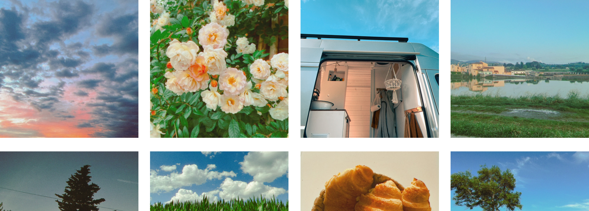

---
# https://vitepress.dev/reference/default-theme-home-page
layout: home

hero:
  name: "Kirby Moments"
  text: "Little Moments Matter. Share Yours."
  tagline: Use this plugin to a photo feed to your Kirby CMS powered website.
  image:
    src: /u-camera.svg
    alt: Kirby Moments
  
---

<section class="intro">
	<figure>
		
		<svg xmlns="http://www.w3.org/2000/svg" viewBox="0 0 2587 931" fill="none"><path fill="url(#b)" d="M0 0h2587v931H0z"/><defs><linearGradient id="b" x1="1293.5" x2="1293.5" y1="200" y2="931" gradientUnits="userSpaceOnUse"><stop stop-color="var(--vp-c-bg)" stop-opacity="0"/><stop offset="1" stop-color="var(--vp-c-bg)"/></linearGradient></defs></svg>
	</figure>
	<h2 class="text-center h1">Claim back your photo feed</h2>
</section>

<section class="section">
	

		

			<h3 class="h3">Apple Shortcut</h3>
			
Use a Shortcut on your Apple devices to quickly post a new photo in seconds.

		

		

			<h3 class="h3">RSS Feed</h3>
			
Let your friends subscribe to your photo feed via RSS like it's 2005.

		

		

			<h3 class="h3">Fully customizable</h3>
			
While the plugin comes with styles and (optional) javascript, it can easily be customized to your likings.

		

	

</section>